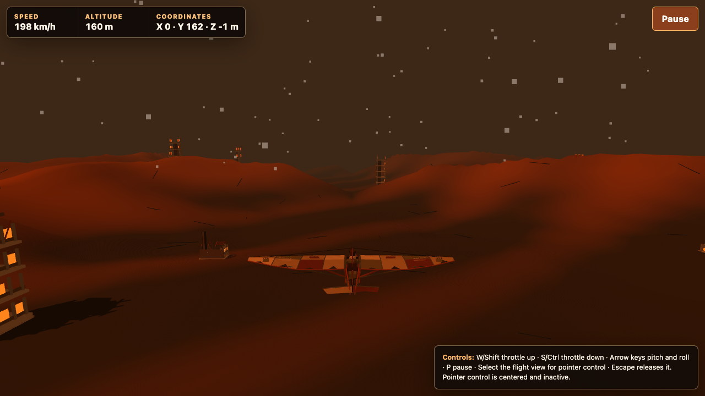

# Wasteland Flight Simulator

A deterministic, browser-based 3D glider simulator set above a procedurally
generated post-apocalyptic landscape. The complete production application lives
in a single [`index.html`](./index.html); Node.js and the rest of the repository
exist only for development, testing, and release evidence.



## What it includes

- A Blender-authored scrap ultralight with patched canvas wings, exposed framing,
  and a seated pilot; [editable source and regeneration tools](./art/glider/README.md)
  accompany geometry embedded directly in the HTML.
- Forgiving but speed-dependent glider physics with lift, drag, gravity, banked
  turns, self-leveling, recoverable stalls, and terrain impacts.
- A camera locked behind and above the glider, with the world horizon providing
  the attitude cue.
- Deterministic, streamed terrain with mountains, cracks, warm lighting, shadows,
  fog, and ash. Four Blender-authored building designs mix ruined towers, an
  industrial works, and a low concrete shell; [editable models and tools](./art/buildings/README.md)
  accompany their embedded geometry.
- Keyboard, optional pointer-lock, and multi-touch controls.
- Desktop and mobile layouts, safe-area handling, deliberate pause/resume,
  portrait-orientation protection, visible focus, and reduced-motion support.
- A fixed 60 Hz simulation and bounded adaptive visual quality.
- No accounts, cookies, storage, analytics, telemetry, backend, or persistent
  player data.

## Runtime architecture

The production topology is intentionally small:

```text
Browser --HTTPS--> static web server --file--> index.html
   |
   +--HTTPS--> jsDelivr --verified bytes--> Three.js and simplex-noise
```

`index.html` is the only shipped application artifact. At startup, the browser
fetches exactly two pinned runtime dependencies:

| Dependency    | Version   | Purpose                                         |
| ------------- | --------- | ----------------------------------------------- |
| Three.js      | `0.185.1` | WebGL scene, geometry, materials, and rendering |
| simplex-noise | `4.0.3`   | Seeded procedural terrain noise                 |

The application verifies the SHA-384 digest of both responses before importing
them through local blob URLs. Redirects, timeouts, unexpected sizes, hash
mismatches, parse errors, or missing exports fail closed and expose a controlled
Retry action. The exact URLs, byte counts, hashes, and allowed Content Security
Policy are documented in the
[runtime dependency contract](./specs/001-wasteland-flight-simulator/contracts/runtime-dependency-contract.md).

## Browser support

- Current stable Chrome and Safari on desktop.
- Current stable Chrome on Android.
- Current stable Safari and Chrome on iOS.
- WebGL 2 and Web Crypto are required.
- Mobile gameplay is landscape-only. Portrait mode pauses the simulator and
  requires an explicit Resume after returning to landscape.

Production and physical-device previews must use HTTPS. Localhost
(`http://127.0.0.1`) is also treated as a trustworthy browser context, but a
plain HTTP LAN address is not suitable for mobile Web Crypto validation.

## Controls

### Desktop

| Action                      | Control                          |
| --------------------------- | -------------------------------- |
| Increase throttle           | `W` or `Shift`                   |
| Decrease throttle           | `S` or `Ctrl`                    |
| Pitch up/down               | `Arrow Up` / `Arrow Down`        |
| Roll left/right             | `Arrow Left` / `Arrow Right`     |
| Enable pointer control      | Select the flight canvas         |
| Release pointer control     | `Escape`                         |
| Pause or resume             | `P` or the visible action button |
| Restart after a crash       | `R` or the Restart button        |
| Activate the focused action | `Enter`                          |

Pointer movement drives a bounded virtual stick rather than rotating the camera.
Releasing pointer lock, pausing, losing focus, crashing, or changing orientation
returns the stick to neutral.

### Mobile

- Use the left virtual joystick for pitch and roll.
- Hold **Throttle +** or **Throttle -** independently of the joystick.
- Use the semantic Pause, Resume, Restart, and Retry buttons as they appear.
- Returning from portrait or from a backgrounded browser never resumes flight
  automatically.

## Quick start

### Prerequisites

- Node.js `20.20.2`
- npm `10.8.2`
- Current Chrome and Safari for manual desktop checks

The exact Node and npm versions are declared in [`package.json`](./package.json).
Using those versions keeps results aligned with the checked-in lockfile and
validation evidence.

### Install development tooling

```bash
npm ci
npx playwright install chromium webkit
```

On a fresh Linux CI host, Playwright can also install required system packages:

```bash
npx playwright install --with-deps chromium webkit
```

All npm packages are development-only. The production page does not load
anything from `node_modules`.

### Run locally

```bash
npm run serve
```

Open <http://127.0.0.1:4173/>. Expected startup behavior is:

1. The loading state appears immediately.
2. The two pinned CDN responses are fetched in parallel.
3. Both SHA-384 digests and required exports verify.
4. WebGL 2 initializes.
5. The glider, terrain, HUD, and relevant controls appear.

Playwright starts the same local server automatically when a test command runs,
so a separate server process is not required for automated tests.

## Development workflow

The application is physically a single document, but its inline JavaScript is
organized into explicit subsystems for dependency loading, lifecycle, input,
simulation, world streaming, rendering, camera, HUD, and adaptive quality.

### Useful commands

| Command                                 | Purpose                                                                              |
| --------------------------------------- | ------------------------------------------------------------------------------------ |
| `npm run serve`                         | Serve the repository at `127.0.0.1:4173` without caching                             |
| `npm run format`                        | Format the application, configuration, tests, and evidence                           |
| `npm run format:check`                  | Check formatting without modifying files                                             |
| `npm run lint`                          | Run ESLint with zero warnings allowed                                                |
| `npm run buildings:embed`               | Validate and embed the saved Blender building export                                 |
| `npm run buildings:check`               | Verify building geometry, provenance, budgets, and embedding consistency             |
| `npm run typecheck`                     | Run strict TypeScript `checkJs` validation                                           |
| `npm run verify:runtime-deps`           | Verify exact runtime URLs, bytes, hashes, exports, licenses, CSP, and request budget |
| `npm run verify:forbidden-runtime-apis` | Reject prohibited runtime APIs and behaviors                                         |
| `npm run audit:dependencies`            | Audit the development dependency resolution                                          |
| `npm run test:unit`                     | Run deterministic flight, terrain, lifecycle, and input tests                        |
| `npm run test:integration`              | Run dependency, streaming, crash/restart, and responsive-control tests               |
| `npm run test:e2e`                      | Run desktop and mobile flight journeys                                               |
| `npm run test:accessibility`            | Run automated accessibility and lifecycle assertions                                 |
| `npm run test:network`                  | Exercise CDN success and fail-closed dependency cases                                |
| `npm run test:performance:smoke`        | Run the short performance contract matrix                                            |
| `npm run test:performance:full`         | Run the full automated performance workloads                                         |
| `npm test`                              | Run the complete Playwright matrix                                                   |
| `npm run validate:automated`            | Run asset checks, formatting, lint, types, security checks, and all automated tests  |
| `npm run validate`                      | Run automated validation and require the formal physical-device qualification report |

Recommended inner loop:

```bash
npm run format:check
npm run lint
npm run typecheck
npm run test:unit
```

Before review or deployment, run at least:

```bash
npm run validate:automated
npm run audit:dependencies
```

Formal release qualification additionally requires the physical-device and
manual evidence described under [Release qualification](#release-qualification).

### Test matrix

[`playwright.config.js`](./playwright.config.js) defines four projects:

- Desktop Chromium at 1280x720.
- Desktop WebKit at 1280x720.
- Mobile Chromium using a Pixel 7 landscape profile.
- Mobile WebKit using an iPhone 13 landscape profile.

Tests cover deterministic fixtures, terrain seams, region recycling, origin
rebasing, stalls, crashes and restarts, dependency failures, request allowlisting,
keyboard/pointer/touch input, responsive states, accessibility, and performance
smoke budgets. Building tests also cover descriptor compatibility, complete window
panels, transformed normals, empty regions, and stable pooled resources. Browser emulation is functional evidence; it does not replace the
required physical-device performance runs.

### Repository layout

```text
index.html                           # Sole production artifact
art/glider/                          # Editable Blender glider and export evidence
art/buildings/                       # Four editable Blender buildings and export evidence
package.json / package-lock.json     # Development tooling and exact resolution
eslint.config.js / jsconfig.json     # Static analysis
playwright.config.js                 # Browser projects and test server
tests/
  unit/                              # Pure simulation and input behavior
  integration/                       # Runtime boundaries and lifecycle behavior
  e2e/                               # User journeys, accessibility, performance
  helpers/                           # Fixtures, metrics, dependency verification
specs/001-wasteland-flight-simulator/
  spec.md                            # Requirements and acceptance criteria
  plan.md                            # Architecture and technology decisions
  contracts/                         # Runtime, simulation, UI, performance contracts
  quickstart.md                      # Full validation workflow
  tasks.md                           # Implementation and qualification task ledger
evidence/                            # Generated and reviewed release evidence
```

Development files and `evidence/` are never copied into the runtime package.

## Security and privacy contract

Changes must preserve these production boundaries:

- Ship only root `index.html`.
- Keep the runtime request budget to the document plus the two exact jsDelivr
  dependency responses.
- Verify both dependencies with SHA-384 before evaluation.
- Do not add analytics, telemetry, external assets, fonts, textures, models,
  source maps, fallback CDNs, or automatic retry loops.
- Do not use cookies, local/session storage, IndexedDB, service workers, URL
  parameters, or fragments to influence application behavior.
- Do not expose raw dependency responses, stack traces, source text, or local
  paths in public errors.
- Keep test controls behind the frozen `navigator.webdriver`-only facade.

The app itself collects and transmits no player data. Production web-server
access logs are separate operational data and may include IP addresses and user
agents; configure retention, access, and anonymization according to the host's
privacy policy.

## Production deployment

### Recommended topology

For an Ubuntu server that already runs Nginx, serve `index.html` directly from
that Nginx instance. There is no application server, build output, Node.js
runtime, API, database, or process to supervise. Adding a second Nginx process in
Docker is useful only when container-based packaging and rollback are part of
the server's normal operating model.

Whichever topology is used:

- Terminate TLS at the public Nginx server.
- Redirect HTTP to HTTPS.
- Add an HTTP CSP header equivalent to or stricter than the document's meta CSP.
- Serve only the release copy of `index.html`; unknown paths should return 404.
- Let browsers reach `https://cdn.jsdelivr.net` for the two verified dependency
  downloads. The Ubuntu server itself does not fetch those runtime files.
- Do not configure an SPA fallback that serves `index.html` for every path.

### Prepare a release artifact

From a clean, reviewed checkout:

```bash
npm ci
npx playwright install chromium webkit
npm run validate:automated
npm run audit:dependencies
openssl dgst -sha384 index.html
```

The only file to transfer is `index.html`. Record its commit and digest in the
deployment record. A formal release should also have a passing `npm run validate`
result; see the qualification caveat below.

### Option A: serve directly from host Nginx

Copy the artifact into a versioned directory and switch a stable symlink. For
example, after transferring `index.html` to the server:

```bash
release_id=2026-08-24-001
sudo install -d -o root -g www-data -m 0755 "/srv/wasteland-flight-simulator/releases/${release_id}"
sudo install -o root -g www-data -m 0644 index.html "/srv/wasteland-flight-simulator/releases/${release_id}/index.html"
sudo ln -sfn "/srv/wasteland-flight-simulator/releases/${release_id}" /srv/wasteland-flight-simulator/current
```

Create `/etc/nginx/snippets/wfs-security.conf`:

```nginx
add_header Content-Security-Policy "default-src 'none'; script-src 'unsafe-inline' blob:; connect-src https://cdn.jsdelivr.net; style-src 'unsafe-inline'; img-src data:; font-src 'none'; media-src 'none'; object-src 'none'; worker-src 'none'; frame-src 'none'; frame-ancestors 'none'; base-uri 'none'; form-action 'none'" always;
add_header Referrer-Policy "no-referrer" always;
add_header X-Content-Type-Options "nosniff" always;
add_header X-Frame-Options "DENY" always;
add_header Permissions-Policy "accelerometer=(), camera=(), geolocation=(), gyroscope=(), magnetometer=(), microphone=(), payment=(), usb=()" always;
add_header Cache-Control "no-cache" always;
```

Then create a site such as
`/etc/nginx/sites-available/wasteland-flight-simulator.conf`, replacing the
domain and certificate paths:

```nginx
server {
    listen 80;
    listen [::]:80;
    server_name flight.example.com;

    return 308 https://$host$request_uri;
}

server {
    listen 443 ssl;
    listen [::]:443 ssl;
    server_name flight.example.com;

    ssl_certificate /path/to/fullchain.pem;
    ssl_certificate_key /path/to/privkey.pem;

    root /srv/wasteland-flight-simulator/current;
    index index.html;
    autoindex off;

    include /etc/nginx/snippets/wfs-security.conf;

    gzip on;
    gzip_vary on;
    gzip_min_length 1024;

    location / {
        try_files $uri =404;

        limit_except GET HEAD {
            deny all;
        }
    }
}
```

If an existing TLS front already owns the `server` block, merge the `root`,
`index`, security snippet, compression, and `location` directives into it rather
than creating a competing listener.

Nginx inherits `add_header` directives only when a lower configuration level has
no `add_header` directives of its own. Keep the security headers together in the
snippet and do not add an isolated header inside the `location` block unless the
complete set is included there too.

Enable and verify the site:

```bash
sudo ln -s /etc/nginx/sites-available/wasteland-flight-simulator.conf /etc/nginx/sites-enabled/wasteland-flight-simulator.conf
sudo nginx -t
sudo systemctl reload nginx
curl -fsSI https://flight.example.com/
curl -fsS https://flight.example.com/ | openssl dgst -sha384
```

Compare the remote digest with the reviewed local artifact. In a real browser,
also confirm:

- the page is served over HTTPS;
- the CSP and other security headers are present;
- the console contains no application error;
- the Network panel shows the document and exactly two jsDelivr runtime
  responses; and
- unknown paths return 404.

To roll back, repoint `current` to a previously retained release, run
`sudo nginx -t`, and reload Nginx.

### Option B: Docker behind host Nginx

Use this option when immutable container images, a Compose-based service catalog,
or image-based rollback are operational requirements. Keep the container's HTTP
port bound to loopback so clients cannot bypass the public TLS proxy.

Create a `Dockerfile`:

```dockerfile
FROM nginx:1.28.3-alpine

RUN find /usr/share/nginx/html -mindepth 1 -maxdepth 1 -delete
COPY deploy/container-nginx.conf /etc/nginx/conf.d/default.conf
COPY index.html /usr/share/nginx/html/index.html
```

Treat the Nginx version as a reviewed dependency. For a repeatable production
release, pin the approved image by digest and update it deliberately after image
security review.

Create `deploy/container-nginx.conf`:

```nginx
server {
    listen 80 default_server;
    listen [::]:80 default_server;
    server_name _;

    root /usr/share/nginx/html;
    index index.html;
    autoindex off;

    gzip on;
    gzip_vary on;
    gzip_min_length 1024;

    location / {
        try_files $uri =404;

        limit_except GET HEAD {
            deny all;
        }
    }
}
```

Create `.dockerignore` so the image build cannot accidentally include tests,
evidence, or repository metadata:

```dockerignore
*
!index.html
!Dockerfile
!deploy/
!deploy/container-nginx.conf
```

Create `compose.yaml`:

```yaml
services:
  simulator:
    build:
      context: .
      dockerfile: Dockerfile
    image: wasteland-flight-simulator:local
    restart: unless-stopped
    read_only: true
    security_opt:
      - no-new-privileges:true
    tmpfs:
      - /var/cache/nginx
      - /var/run
    pids_limit: 64
    ports:
      - "127.0.0.1:8088:80"
    healthcheck:
      test: ["CMD-SHELL", "test -s /usr/share/nginx/html/index.html || exit 1"]
      interval: 30s
      timeout: 3s
      retries: 3
```

Build and start it:

```bash
docker compose build --pull
docker compose up -d
docker compose ps
curl -fsSI http://127.0.0.1:8088/
```

In the host's HTTPS Nginx `server` block, include the same security-header
snippet from Option A and proxy to the loopback port:

```nginx
include /etc/nginx/snippets/wfs-security.conf;

location / {
    proxy_pass http://127.0.0.1:8088;
    proxy_http_version 1.1;
    proxy_set_header Host $host;
    proxy_set_header X-Forwarded-Proto $scheme;
    proxy_set_header X-Forwarded-For $proxy_add_x_forwarded_for;
}
```

Validate and reload the host proxy after changing it:

```bash
sudo nginx -t
sudo systemctl reload nginx
curl -fsSI https://flight.example.com/
```

Keep security headers at one clearly owned layer. The examples put them on the
public host Nginx, not the inner container, so configuration drift cannot create
conflicting duplicate policies.

### Production operations checklist

- Keep DNS and TLS certificate renewal monitored.
- Expose only public ports 80 and 443; keep a container origin on loopback or a
  private Docker network.
- Validate Nginx configuration before every reload.
- Retain the previous artifact or image digest for rollback.
- Compare the deployed `index.html` digest with the approved release digest.
- Review Nginx and container-image security updates on a regular schedule.
- Re-run the runtime dependency and npm audits before each release.
- Monitor origin availability, TLS failures, 4xx/5xx rates, and CDN reachability
  without adding browser telemetry to the application.
- Apply an HSTS policy only when the hostname and any selected subdomains are
  intended to remain HTTPS-only.
- Never replace the two pinned CDN URLs or hashes as an emergency fallback;
  review and test any dependency update as a source change.

## Release qualification

The Dustkite change passed 160 automated tests with four non-applicable project
skips and zero failures, plus 20 performance smoke checks using one worker. See
the [asset validation report](./art/glider/validation/report.json). Headless frame
timings missed the release targets; these checks do not establish physical-device
performance qualification. The [earlier test matrix](./evidence/validation/automated-tests.md)
records the pre-Dustkite baseline.

The checked-in [final validation report](./evidence/validation/final-report.md)
still fails closed because formal desktop/mobile performance captures and a
required physical accessibility review are missing. The application can be
deployed for preview or evaluation, but do not describe the current checkout as
fully release-qualified until these commands have produced valid evidence:

```bash
npm run qualify:preflight
npm run qualify:desktop
npm run qualify:android
npm run qualify:ios
npm run qualify:report
npm run validate
```

Reference qualification uses an Apple M1 desktop with Chrome and Safari, a
physical Pixel 7 with Chrome, and a physical iPhone 13 with Safari and Chrome.
Missing hardware, dirty artifacts, unexpected requests, console errors,
over-budget results, or incomplete reviewer provenance are failures rather than
skips. See the [validation quickstart](./specs/001-wasteland-flight-simulator/quickstart.md)
and [performance contract](./specs/001-wasteland-flight-simulator/contracts/performance-contract.md).

## Troubleshooting

### The page reports an unsupported browser or dependency error

- Confirm the browser supports WebGL 2 and Web Crypto.
- Use `https://` in production or `http://127.0.0.1` locally.
- Confirm browser extensions, a firewall, DNS filtering, or a corporate proxy
  are not blocking `cdn.jsdelivr.net` or rewriting its responses.
- Run `npm run verify:runtime-deps` to distinguish a local artifact change from
  a network problem.
- Do not weaken CSP or bypass digest verification to make startup succeed.

### Playwright cannot find a browser

```bash
npx playwright install chromium webkit
```

On Linux, add `--with-deps` when the host is also missing browser system
libraries.

### Port 4173 is already in use

Stop the process already bound to `127.0.0.1:4173`, or allow the Playwright-owned
server to start without running `npm run serve` separately.

### Mobile testing works on localhost but not over the LAN

A plain LAN HTTP origin is not an acceptable production-like secure context.
Expose the preview through trusted HTTPS, then repeat the test on the physical
device.

## Design and contributor documentation

- [Feature specification](./specs/001-wasteland-flight-simulator/spec.md)
- [Implementation plan](./specs/001-wasteland-flight-simulator/plan.md)
- [Data model](./specs/001-wasteland-flight-simulator/data-model.md)
- [Simulation contract](./specs/001-wasteland-flight-simulator/contracts/simulation-contract.md)
- [UI and input contract](./specs/001-wasteland-flight-simulator/contracts/ui-state-contract.md)
- [Runtime dependency contract](./specs/001-wasteland-flight-simulator/contracts/runtime-dependency-contract.md)
- [Performance contract](./specs/001-wasteland-flight-simulator/contracts/performance-contract.md)
- [Task ledger](./specs/001-wasteland-flight-simulator/tasks.md)
- [Evidence policy](./evidence/README.md)

Before changing behavior, update the applicable requirement or contract and its
tests. Preserve deterministic fixtures and distinguish automated browser results,
manual visual/accessibility review, and physical-device qualification in all
status reports.

## Licensing

Three.js and simplex-noise are MIT licensed; reviewed notices are stored under
[`evidence/licenses/`](./evidence/licenses/). This repository does not currently
contain a project-level `LICENSE` file, so no separate license is asserted here
for the application source.

## Deployment references

- [Nginx: serving static content and reloading configuration](https://nginx.org/en/docs/beginners_guide.html)
- [Nginx response-header directives](https://nginx.org/en/docs/http/ngx_http_headers_module.html)
- [Docker Official Nginx image](https://hub.docker.com/_/nginx)
- [Docker Compose service reference](https://docs.docker.com/reference/compose-file/services/)
