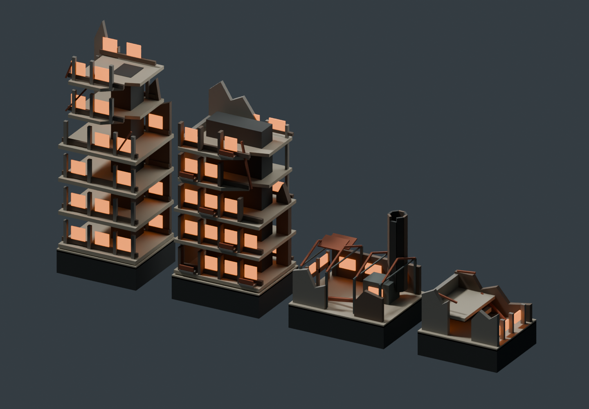

# Wasteland building set

Four original stylized ruins: a broken office tower, a residential slab, an
industrial works with a hollow chimney, and a low concrete shell. Exposed floors,
solid broken wall edges, rusted frames, recessed bays, and orange windows share the
Dustkite glider's palette. All models are visual scenery with no collision.



## Editable source

`buildings.blend` contains four named `*_EXPORT` collections arranged in a gallery.
Each collection owns `body` and `windows` subcollections and records its nominal
dimensions and gallery origin. The studio is excluded from export. Edit these
collections directly. Running `create_scene.py` rebuilds the original designs and
overwrites manual changes; preserve a copy before rebuilding an edited source.

The exporter reopens the saved source, evaluates transforms/modifiers, removes the
gallery offset, converts Blender axes to game +Y up/-Z forward, and normalizes the
footprint to X/Z ±0.5 and the above-ground height to Y 0–1. Foundations extend below
zero. Normals use the inverse transpose of this normalization. Split normals and
linear vertex colors are preserved, quantized to five decimals, and deduplicated.
Every named window object becomes a contiguous complete-panel index range.

Use opaque Principled palette materials or vertex colors. Linked shader inputs,
textures, transparency, animation, and rigs are unsupported. The runtime supplies
one shared rough opaque material and one shared emissive orange window material.
There are no new runtime requests, loaders, textures, or dependencies.

## Regeneration

From the repository root (substitute your Blender executable on other platforms):

```bash
# Optional rebuild: overwrites manual model edits.
/Applications/Blender.app/Contents/MacOS/Blender --background --threads 4 --python art/buildings/create_scene.py

# Export the saved source, then embed it into the only runtime document.
/Applications/Blender.app/Contents/MacOS/Blender --background --threads 4 --python art/buildings/export_geometry.py
npm run buildings:embed

# Reopen and verify the delivered file in a separate Blender process.
/Applications/Blender.app/Contents/MacOS/Blender --background --threads 4 --python art/buildings/export_geometry.py -- --check
npm run buildings:check

# Render the gallery and front/rear views of every model.
/Applications/Blender.app/Contents/MacOS/Blender --background --threads 4 --python art/buildings/render_previews.py
```

`buildings:check` verifies source/tool hashes, bounds, normals, indices, colors,
nondegenerate triangles, named panel ranges, the 1,000-triangle per-model limit,
and the 1 MiB formatted embedding limit. It fails on embedding drift and is included
in `validate:automated`.

## Placement and ownership

Existing ruin descriptors and their random stream are unchanged. A separate hash
of `damageMask` and `windowSeed` selects four equally weighted models and quarter-turn
rotations; `0:0:0` remains an office tower. Both towers use the sum of the legacy tier
heights. Industrial buildings are 30–55 m tall including the chimney; shells are
12–26 m tall. Rotation-aware scale keeps each instance within its legacy footprint.
Foundations extend at least eight meters below the lowest sampled footprint ground.

Each pooled region owns one fixed-capacity body buffer and one window buffer.
Recycling changes their contents, active draw ranges, and bounds, including an empty
region's zero bounds. Positions and inverse-transpose normals are transformed once
on region assignment. Geometry is never created during flight frames. Window panels
are deterministically shuffled per building and interleaved across the region;
quality changes draw only whole panels without rebuilding or changing silhouettes.

The webdriver-only region snapshot reports model IDs, bounds, geometry/material IDs,
active and capacity counts, panel ranges, and geometry hashes. Production exposes no
inspection or placement API.

## Evidence

With `npm run serve` running separately:

```bash
node art/buildings/capture-browser.js before
node art/buildings/capture-browser.js after
```

The baseline is pinned to glider commit `e2dd19fe78ee7f26b90e1eacd567250d70b71a74`.
Both captures use seed `0x1a2b3c4d`. Normal level/banked flight captures run the exact
release document. Close inspection captures inject a camera-only webdriver helper
into the served document; both original and instrumented hashes are recorded.
The same four original descriptors and camera coordinates are used before/after.
Mobile captures are emulated. Stop the preview server before running Playwright.

See `validation/report.json` for final results, render/load/memory comparisons,
limitations, and qualification status. Automated screenshots and smoke workloads
are not human acceptance or physical-device reference performance qualification.

## Provenance

The models and scripts were authored from basic geometry for this project. No
third-party model, texture, trademark, or franchise design is included. The manifest
records Blender version, bounds, counts, export transformations, and SHA-256 hashes.
No additional project license is asserted; this repository has no project-level license.
