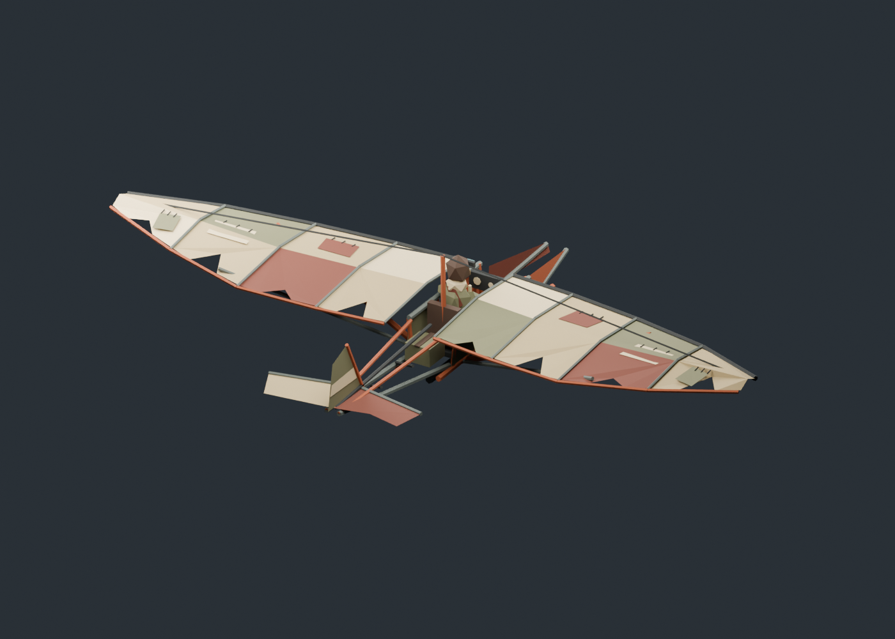

# Dustkite scrap ultralight

An original, stylized wasteland aircraft with patched canvas wings, a welded
tubular frame, scavenged metal cockpit panels, and a static goggled pilot.
The model replaces only the aircraft's appearance. Flight physics and the
fixed chase camera retain their existing behavior.



## Editable source and runtime export

`dustkite.blend` contains 153 named editable parts in `Dustkite_EXPORT` and a
separate studio camera/light setup. Only that collection is exported. Edit the
Blender file directly for manual art changes; running `create_scene.py` rebuilds
the original authored design and overwrites those edits. Preserve a copy first
if you want both versions.

`export_geometry.py` reopens the saved file, evaluates modifiers and transforms,
triangulates faces, preserves split normals and linear vertex colors, and merges
the result into one indexed mesh. It converts Blender +Z up/+Y forward into game
+Y up/−Z forward, rounds to five decimals, and deduplicates matching position,
normal, and color tuples. Material base colors supply vertex colors unless the
mesh has an active color attribute. Use opaque palette materials or vertex colors;
textures, material node effects, rigs, and animation are not part of this exporter.

The runtime uses one double-sided material (roughness 0.85, metalness 0.15).
All geometry is embedded in `index.html`; the browser never requests this folder.
The geometry budgets are 2,500 triangles and 750 KiB of formatted embedded data.
Allowed local bounds are X ±8.5 m, Y −1 to 2.5 m, Z −5.8 to 5.5 m.

## Regeneration

Run these commands from the repository root. Substitute your Blender executable
on other platforms. Blender 5.2.1 was used for the delivered source.

```bash
# Optional: rebuild the original design (overwrites manual .blend edits).
/Applications/Blender.app/Contents/MacOS/Blender --background --threads 4 --python art/glider/create_scene.py

# Export the saved, edited source and embed it in the app.
/Applications/Blender.app/Contents/MacOS/Blender --background --threads 4 --python art/glider/export_geometry.py
npm run glider:embed

# Reopen the source in a fresh process and check reproducibility.
/Applications/Blender.app/Contents/MacOS/Blender --background --threads 4 --python art/glider/export_geometry.py -- --check
npm run glider:check

# Regenerate inspection views from the saved source.
/Applications/Blender.app/Contents/MacOS/Blender --background --threads 4 --python art/glider/render_previews.py
```

The check command validates geometry, indices, finite/unit normals, colors,
nondegenerate triangles, bounds, budgets, source/script/export hashes, and exact
embedding consistency. Both commands fail on drift instead of silently accepting
a stale export. `npm run validate:automated` includes `glider:check`.

Check both exporters' corner/point vertex colors without materials, color
precedence, and palette fallback in an isolated Blender scene:

```bash
/Applications/Blender.app/Contents/MacOS/Blender --background --factory-startup --threads 4 --python-exit-code 1 --python tests/blender/export-colors.py
```

## Browser evidence

With `npm run serve` running separately:

```bash
node art/glider/capture-browser.js before
node art/glider/capture-browser.js after
```

The `before` command serves the committed `HEAD:index.html` through a browser test
route; run it before committing the replacement to retain a meaningful baseline.
`after` captures the working document. Both use seed `0x1a2b3c4d`, level flight
and a fixed bank maneuver, Chromium/WebKit, and desktop/mobile landscape layouts.
Counters are sampled after rendering; mobile captures are emulation, not physical
device qualification. Stop the preview server before running Playwright suites.

`validation/report.json` records the delivered checks, limitations, and render
counter comparison. Browser captures, before/after metrics, and Blender views are
included for review. Physical-device performance remains an OPEN release gate.

## Provenance

This asset and its scripts were authored for this project from basic geometry.
No third-party models, textures, franchise logos, or copied vehicle designs are
included. `manifest.json` records source and transformation provenance, part
ranges, bounds, counts, and SHA-256 hashes. No separate project license is asserted;
the repository currently has no project-level license.
